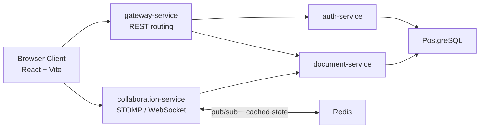
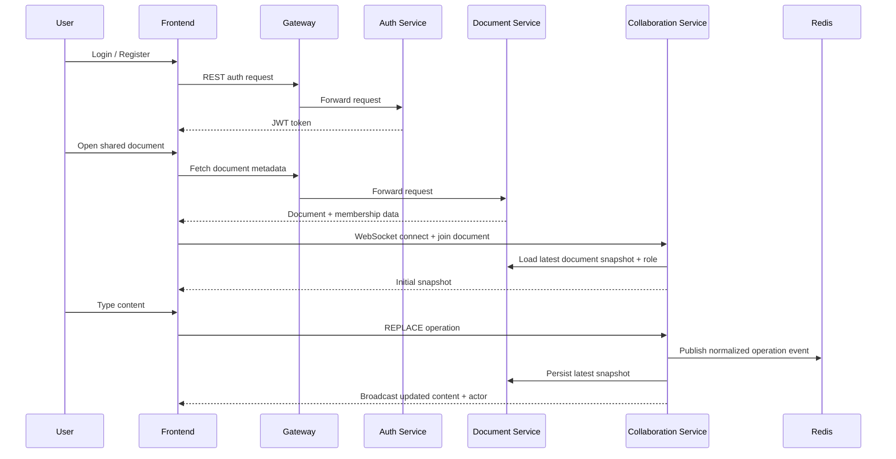
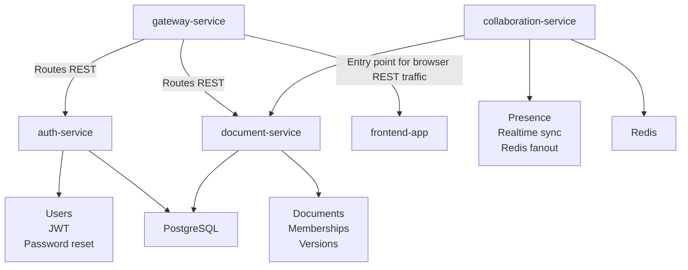

# Collaborative Docs Platform

Real-time collaborative document editing platform built with Java, Spring Boot, WebSockets, Redis, PostgreSQL, Docker, and a React browser client. The system supports concurrent editing, presence, version history, sharing, JWT-based authentication, and password reset flows.

## Why This Project

This project was built to demonstrate backend system design for a Google Docs style collaboration workflow:

- low-latency document updates over WebSockets
- conflict-safe collaborative editing
- horizontal scaling through Redis pub/sub
- persistent document and auth state in PostgreSQL
- clear separation between gateway, auth, document, and collaboration responsibilities

## Architecture Overview



## Request Flow



## Service Boundaries



## Modules

- `gateway-service`
  Routes REST traffic to downstream services and acts as the main API entry point for the browser client.

- `auth-service`
  Handles registration, login, JWT issuance, user lookup for sharing, duplicate-user protection, and password reset email delivery.

- `document-service`
  Owns document CRUD, access control, memberships, version history, rollback, and durable document state.

- `collaboration-service`
  Owns WebSocket/STOMP collaboration, presence tracking, Redis fanout, and synchronized live document updates.

- `frontend-app`
  React-based browser client for login, registration, document creation, sharing, version rollback, and real-time editing.

## Tech Stack

- Java 17
- Spring Boot 3.3
- Spring Cloud Gateway
- Spring WebSocket + STOMP
- Redis 7
- PostgreSQL 16
- Flyway
- React + Vite + TypeScript
- Docker Compose
- JUnit + Spring Boot Test

## Key Features

- Real-time collaborative editing
- Presence tracking for active collaborators
- Owner/editor/viewer access control
- Version history with rollback
- JWT-based authentication
- Duplicate username and email validation
- Password reset flow
- Docker-first local development
- Redis-based scaling path for collaboration fanout

## Collaboration Model

The current live sync path uses a durable full-document replacement operation for stability at demo time, while the service still retains CRDT-oriented internal structures from the original collaboration design.

Why this choice was made:

- it avoids client/server drift during rapid edits
- it keeps the browser experience reliable for portfolio demos
- it is easier to explain during interviews than a partially stable transform pipeline

Tradeoff:

- this is not a full Google Docs rich-text engine
- it is a strong collaborative text backend demo with clear scaling boundaries and sensible engineering tradeoffs

## Data Model

### `auth.users`

- `id UUID`
- `username VARCHAR(80) UNIQUE`
- `email VARCHAR(120) UNIQUE`
- `password_hash VARCHAR(200)`
- `role VARCHAR(30)`
- `created_at TIMESTAMP WITH TIME ZONE`

### `auth.password_reset_tokens`

- `id BIGSERIAL`
- `user_id UUID`
- `token VARCHAR`
- `expires_at TIMESTAMP WITH TIME ZONE`
- `used_at TIMESTAMP WITH TIME ZONE`
- `created_at TIMESTAMP WITH TIME ZONE`

### `document.documents`

- `id UUID`
- `title`
- `content`
- `owner_id`
- `current_version`
- `created_at`
- `updated_at`

### `document.document_memberships`

- `document_id`
- `user_id`
- `role`
- `created_at`

### `document.document_versions`

- `id BIGSERIAL`
- `document_id`
- `version_number`
- `title`
- `content`
- `created_by`
- `event_type`
- `created_at`

## API Summary

### Auth

- `POST /api/auth/register`
- `POST /api/auth/login`
- `POST /api/auth/forgot-password`
- `POST /api/auth/reset-password`
- `GET /api/auth/users`

### Documents

- `POST /api/documents`
- `GET /api/documents`
- `GET /api/documents/{id}`
- `PUT /api/documents/{id}`
- `DELETE /api/documents/{id}`
- `GET /api/documents/{id}/members`
- `POST /api/documents/{id}/members`
- `GET /api/documents/{id}/versions`
- `POST /api/documents/{id}/rollback/{versionId}`

### Collaboration REST

- `GET /api/collaboration/documents/{id}/state`

### WebSocket

- endpoint: `ws://localhost:8082/ws/collaboration`
- join destination: `/app/documents/{documentId}/join`
- edit destination: `/app/documents/{documentId}/operations`
- operations topic: `/topic/documents.{documentId}.operations`
- presence topic: `/topic/documents.{documentId}.presence`
- snapshot queue: `/user/queue/documents.{documentId}.snapshot`

## Local Setup

### Option 1: Local demo mail with MailHog

Use this if you want password reset to work locally without external SMTP credentials.

```powershell
cd "project folder"
docker compose up --build
```

Available endpoints:

- frontend: [http://localhost:3000](http://localhost:3000)
- gateway: [http://localhost:8080](http://localhost:8080)
- collaboration service: [http://localhost:8082](http://localhost:8082)
- MailHog inbox: [http://localhost:8025](http://localhost:8025)

### Option 2: External SMTP provider

Create `.env` from .env.example and set your provider values.

Example:

```env
MAIL_HOST=smtp.gmail.com
MAIL_PORT=587
MAIL_USERNAME=your-email@example.com
MAIL_PASSWORD=your-app-password
MAIL_SMTP_AUTH=true
MAIL_SMTP_STARTTLS=true
PASSWORD_RESET_URL=http://localhost:3000
PASSWORD_RESET_INBOX_URL=
PASSWORD_RESET_FROM=your-email@example.com
```

Then run:

```powershell
cd "project folder"
docker compose up --build
```

## How To Test

### End-to-end collaboration

1. Open [http://localhost:3000](http://localhost:3000)
2. Register `user1`
3. Register `user2` in another browser or incognito window
4. Login as `user1`
5. Create a document
6. Share the document with `user2` as `EDITOR`
7. Open the same document in both windows
8. Type in one browser and verify the other updates in real time
9. Confirm `Active collaborators` updates
10. Confirm `Last updated by` shows usernames

### Password reset

1. Open the login screen
2. Click `Forgot password`
3. Enter a registered email
4. If using MailHog, open [http://localhost:8025](http://localhost:8025)
5. Copy the reset token from the email
6. Paste it into the reset form
7. Set a new password
8. Login again with the new password

### Persistence

Normal stop and restart should preserve users and documents:

```powershell
docker compose down
docker compose up --build
```

Only use this when you intentionally want a full reset:

```powershell
docker compose down --volumes
```

## Local Development Without Docker

### Backend

```powershell
cd "project folder"
.\.tools\apache-maven-3.9.9\bin\mvn.cmd -B test
```

### Frontend

```powershell
cd "project frontend"
npm install
npm run build
npm run dev
```

## Scaling Strategy

- Gateway and services are stateless at the HTTP layer
- PostgreSQL stores durable auth and document state
- Redis distributes collaboration events across instances
- collaboration state is designed for horizontal fanout
- the system can evolve toward broker relay or Kafka-based replay if higher durability or event history is required

## Future Improvements

- Rich-text collaborative editor with cursor and selection overlays
- Per-character or per-range authorship attribution
- Kafka-backed event replay and analytics pipeline
- End-to-end browser automation coverage
- Stronger production security hardening and audit logging

